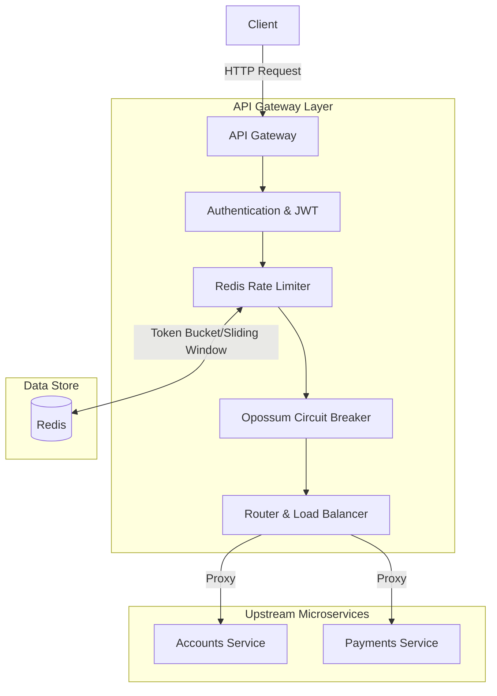

# Custom API Gateway


A high-performance, resilient, horizontally scalable API Gateway (Reverse Proxy) designed for microservices architectures. Built with Node.js and Express.

## Live Demo

> 🚀 **Try it out!** 
> A live sandbox of this API Gateway is actively hosted on Render. You can interact with the public `/health` endpoint here:
> [https://custom-api-gateway-demo.onrender.com/health](https://custom-api-gateway-demo.onrender.com/health)

## Architecture



## Key Features

- **Dynamic Reverse Proxy**: Path-based routing to configured upstream microservices via `http-proxy-middleware`.
- **Load Balancing**: Custom built-in round-robin load balancer.
- **Robust Rate Limiting**: Distributed Sliding-Window / Token-Bucket rate limiting backed by Redis. Supports global limits and per-route limits.
- **Resilience & Circuit Breaking**: Protects downstream services with `opossum` circuit breakers (timeouts, error thresholds). Fail-safe design.
- **Security & Authentication**:
  - JWT Verification with downstream claim forwarding (`X-User-Id`, `X-Roles`).
  - API Key Authentication for service-to-service communication.
- **Observability**:
  - Injects correlation IDs (`X-Correlation-ID`) across boundaries.
  - High-performance, structured JSON logging via `pino`.
  - Prometheus metrics exposed automatically at `/metrics`.
- **Hot-Reloadable Configuration**: Declarative YAML/JSON configuration (`gateway.json`) managed via `chokidar`. Configuration can be reloaded on-the-fly without dropping traffic.
- **Admin Operations**: Health checks (`/healthz`, `/readyz`) and secured config reload endpoints (`/admin/reload`).

## Tech Stack
- **Core**: Node.js, Express
- **State Store**: Redis (via `ioredis`)
- **Key Libraries**: `http-proxy-middleware`, `opossum`, `jsonwebtoken`, `pino`, `prom-client`
- **Testing**: Jest, Supertest

## Installation

1. Ensure you have Node.js (v18+) and Redis installed.
2. Clone the repository and install dependencies:
   ```bash
   git clone https://github.com/tarun-sarojsingh/Custom_API_Gateway.git
   cd Custom_API_Gateway
   npm install
   ```

## Configuration

The gateway uses a configuration-over-code philosophy. Modify `gateway.json` in the root of the directory to define your routing and cluster topologies:

```json
{
  "server": { "port": 8080 },
  "redis": { "address": "localhost:6379", "db": 0 },
  "global_rate_limit": { "requests_per_second": 100, "burst": 20 },
  "clusters": [
    {
      "name": "accounts-service",
      "instances": ["http://localhost:8081"],
      "circuit_breaker": { "timeout_ms": 3000, "max_requests": 5, "interval_ms": 10000 }
    }
  ],
  "routes": [
    {
      "path_prefix": "/accounts",
      "upstream_cluster": "accounts-service",
      "auth_required": true,
      "rateLimit": { "requests_per_second": 50 }
    },
    {
      "path_prefix": "/public",
      "upstream_cluster": "accounts-service",
      "auth_required": false
    }
  ]
}
```

## Running the Application

Ensure Redis is running (`redis-server`), then start the gateway:

```bash
npm start
```

For development mode (with `nodemon` and pretty logs):

```bash
npm run dev
```

## End-to-End Examples

### 1. Unauthenticated Public Request
Testing a public route configured without `auth_required`:

**Request:**
```bash
curl -i -X GET http://localhost:8080/public/status
```

**Response:**
```http
HTTP/1.1 200 OK
X-Powered-By: Express
X-Correlation-ID: a9d8c3f2-1b12-4c22-b912-7f89cda1234b
X-RateLimit-Limit: 100
X-RateLimit-Remaining: 99
X-RateLimit-Reset: 1
Content-Type: application/json; charset=utf-8
Date: Thu, 20 Aug 2026 12:00:00 GMT
Connection: keep-alive

{"status":"operational","service":"public"}
```

### 2. Authenticated Request (JWT)
Testing a protected route requiring a JWT token:

**Request:**
```bash
curl -i -X GET http://localhost:8080/accounts/me \
  -H "Authorization: Bearer eyJhbGci..."
```

**Response:**
```http
HTTP/1.1 200 OK
X-Powered-By: Express
X-Correlation-ID: b12c4d7f-9988-4a11-cc22-8f99def1234c
X-RateLimit-Limit: 50
X-RateLimit-Remaining: 49
X-RateLimit-Reset: 1
Content-Type: application/json; charset=utf-8
Date: Thu, 20 Aug 2026 12:00:05 GMT

{"account_id":"user123","balance":150.00}
```
*(Notice that the gateway forwards `X-User-Id` and `X-Roles` to the downstream `accounts-service` based on the decoded JWT claims).*

### 3. Rate Limit Exceeded
When a client sends too many requests in the given window:

**Request:**
```bash
curl -i -X GET http://localhost:8080/public/status
```

**Response:**
```http
HTTP/1.1 429 Too Many Requests
X-Powered-By: Express
X-RateLimit-Limit: 100
X-RateLimit-Remaining: 0
X-RateLimit-Reset: 1
Retry-After: 1
Content-Type: application/json; charset=utf-8
Date: Thu, 20 Aug 2026 12:00:10 GMT

{"error":"Too Many Requests"}
```

## Endpoints

### Administrative
- `GET /health` : Simple check to see if the server process is alive.
- `GET /healthz` : Detailed health check.
- `GET /readyz` : Readiness probe for load balancers.
- `GET /metrics` : Prometheus scraped metrics.
- `POST /admin/reload` : Hot-reload the gateway configuration. Requires `Authorization: Bearer <ADMIN_TOKEN>`.

### Testing & Coverage

The project uses `jest` with a full suite of unit and integration tests covering the Proxy, Rate Limiter, and Auth middleware.

Run the test suite and generate a coverage report:

```bash
npm test
```
*Expected Output: `Test Suites: 2 passed | Coverage: 100% Statements`*

## License

This project is licensed under the **ISC License**. See the [LICENSE](LICENSE) file for more details.
